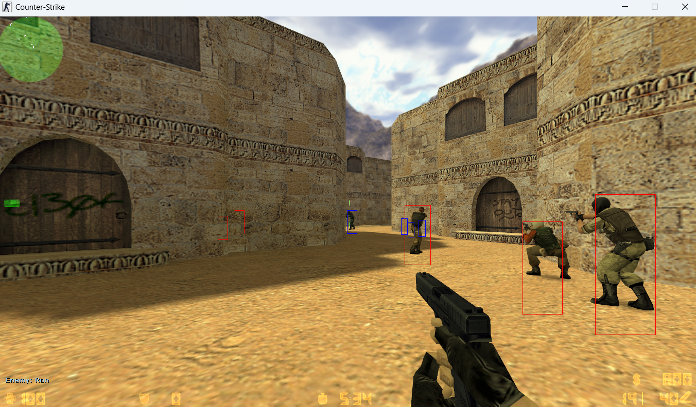

# Simple external cheat for Counter-Strike 1.6



The cheat was strictly created for educational purposes, to help novice
developers better understand the low-level processes of games. The project
should be the entry point.

Exploring low-level capabilities and engaging in reverse engineering
for educational purposes greatly develops your developer skills. You learn to
understand the source of all processes, expand your horizons, and gradually
become a master. I believe in you, and perhaps every professional is simply
obliged to study the field of low-level programming to some extent.

**THE AUTHOR DOES NOT SUPPORT UNFAIR PLAY IN MULTIPLAYER GAMES AND THE PROJECT
IS SPECIFICALLY DESIGNED TO BE HARMLESS**

**THE CHEAT WILL GIVE YOU ALMOST NO ADVANTAGE, BECAUSE THE PROBLEM OF THE
PVS (POTENTIALLY VISIBLE SET) SYSTEM OF PLAYERS HAS NOT BEEN SOLVED, WHICH IS
WHY WALLHACK ONLY WORKS AT VERY CLOSE DISTANCES, WHERE IT IS NO LONGER VERY
USEFUL**

## Build

The cheat was checked for the game version:

```markdown
Protocol version 48
Exe version 1.1.2.7/Stdio (cstrike)
Exe build: 19:06:31 Oct 7 2024 (10210)
```

On other versions of the game, you may need to manually change the offsets.
They can be easily found using Cheat Engine.

## Unresolved issues

**SERIOUS STATIC ANALYSIS OF THE GAME CODE IS REQUIRED TO SOLVE THESE PROBLEMS.
IT'S NOT FOR BEGINNERS.**

1) The found offset of all players is updated only when the player is close to
   us. This problem needs serious reversal. I assume that this is the so-called
   PVS (Potentially Visible Set) system, which updates player data only when
   they are in your line of sight. If you are in the spectator mode, then 
   this PVS area will greatly increase.

2) The cheat reads the game's memory from outside. Such cheats are called
   external, and they are usually more difficult to detect, but they have
   a serious disadvantage, which is why such cheats are condemned in the cheat
   development community.
   
   The cheat has a serious optimization problem, the window needs to be created
   on top of the game window, which is why the cheat does not work with the
   full-screen game mode and the game itself may become less smooth.

3) Most servers have different mods and different server settings.
   Because of this, somewhere the PVS system may be optimized as much as
   possible and there may be other player offsets, as well as other model
   names, which is why their team will be incorrectly identified. A separate
   configuration may be required for a specific server.

## Project structure

- `process_detective.rs` - a wrapper for controlling the game process,
   including memory reading via WinAPI
- `cs_modules.rs` - all found game structures with their offsets
- `keyboard.rs` - a wrapper over receiving a pressed key
- `vector3.rs` - a simple implementation of perhaps the most popular struct
   in 3d game development
- `game.rs` - create a `winit` window and easily manage registered cheats
- `wallhack.rs`, `offsets_logger.rs` - examples of cheats

The `softbuffer` library is used, which is probably the library
for rendering in a window using a buffer.